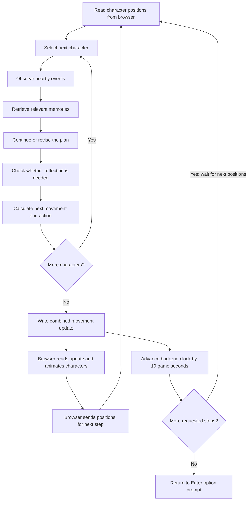

# Understanding the simulator

The simulator combines a game environment with a separate memory and planning
system for each character. The language model supplies decisions and descriptions;
Python manages time, memories, schedules, and movement.

Associated paper: [Generative Agents: Interactive Simulacra of Human Behavior](https://arxiv.org/html/2304.03442v2)
([DOI: 10.1145/3586183.3606763](https://doi.org/10.1145/3586183.3606763)).
Sections 4–5 describe the architecture and environment. This guide describes the
local implementation, including its updated GPT Sol integration.

## What happens when you enter `run 20`?

The backend processes 20 simulation steps. Within each step, it processes all
characters one after another, then writes their combined update for the browser.



The backend and browser coordinate through step-numbered environment and movement
files. If one character needs several model calls, the display can appear to pause
while the backend finishes the combined update.

## What each character does

1. **Observe:** Read nearby people and objects from the map. Turn observations into
   memory records—for example, “the café counter is being used.”
2. **Retrieve:** Find memories connected to the situation. The code includes
   event-based lookup and a richer ranking using recency, importance, and semantic
   similarity.
3. **Plan:** On the first day or a new day, generate a daily plan and hourly
   schedule. Break upcoming activities into smaller tasks. During later steps,
   continue the current activity or consider reacting to another character.
4. **Reflect:** Check whether enough important experiences have accumulated to
   generate broader insights from memories.
5. **Execute:** Choose the next map tile along a path, or remain in place, and
   return an action description and emoji.

These stages run each step, but they do not all call the model every time.
Continuing an existing activity or following an already calculated path can be
quick. Creating the first day's schedule can require many requests.

The main per-character sequence is in
[`persona.py`](reverie/backend_server/persona/persona.py), inside `Persona.move`.
The outer simulation loop is in
[`reverie.py`](reverie/backend_server/reverie.py), inside `ReverieServer.start_server`.

## Game time versus real time

With `sec_per_step` set to 10, `run 20` advances the backend clock by 200 game
seconds: **3 minutes 20 seconds**. It does not promise 200 seconds of animation.
Real elapsed time depends on model requests and the browser/backend exchange.

A character working at a counter for 30 game minutes can remain stationary for
180 steps. Lack of walking does not by itself indicate a stalled simulation.
The browser displays the timestamp attached to a movement update, which can be
one step behind the backend's already-incremented clock.

## Reading the logs

| Message | Meaning |
| --- | --- |
| `generate_wake_up_hour` | Choose a wake-up time. |
| `generate_first_daily_plan` | Create the broad daily plan. |
| `generate_hourly_schedule` | Fill in activities hour by hour. |
| `generate_task_decomp` | Break a longer activity into smaller tasks. |
| `generate_action_sector`, `arena`, `game_object` | Choose a destination: area, room/place, then object. |
| `generate_action_pronunciatio` | Generate an activity emoji. |
| `generate_action_event_triple` | Represent an action as subject, relationship, object. |
| `generate_act_obj_desc` | Describe an object's state during an activity. |
| `generate_decide_to_talk`, `generate_convo` | Decide whether to talk and generate dialogue. |
| `generate_poig_score` | Rate an experience's importance. |
| `generate_focal_points`, `generate_insights_and_evidence` | Generate reflection questions and insights. |

Prompt blocks show the character, legacy request settings, supplied prompt, and
returned or processed output. They are not a transcript of the model's hidden
internal reasoning.

Legacy `gpt_param` output can still name `text-davinci-003`. The updated shared
adapter overrides that engine field and defaults to `gpt-5.6-sol`; `OPENAI_MODEL`
can override that default.

### Reflection counters

```text
Isabella Rodriguez persona.scratch.importance_trigger_curr:: 142
150
```

Here, 142 is the remaining reflection counter and 150 is its reset value.
Recorded experiences reduce the counter by their importance scores. At zero or
below, reflection can trigger. Repeated values mean no additional importance was
accumulated between those checks. These values are not tokens, progress, or energy.

This counter controls reflection, not immediate schedule changes. Conversation
and waiting decisions use separate rules and model calls in the planner.

Strings such as `asdhfapsh8p9hfaiafdsi` and `aldhfoaf/????` are leftover developer
debug markers; they have no simulation meaning. A Python `Traceback`, however,
indicates a failure that needs inspection.

## Inspecting a running simulation

Enter these commands individually when the backend displays `Enter option:`:

```text
print current time
print all persona schedule
print persona schedule Isabella Rodriguez
print persona current tile Isabella Rodriguez
print persona associative memory (event) Isabella Rodriguez
print persona associative memory (thought) Isabella Rodriguez
print persona associative memory (chat) Isabella Rodriguez
```

- **Events:** Stored observations.
- **Thoughts:** Reflections, planning notes, and other stored inferences.
- **Chats:** Stored conversations.

These inspection commands do not advance the simulation. Replace Isabella's name
with another character's full name to inspect that character. Start with the time
and schedules to understand what each character should currently be doing.
